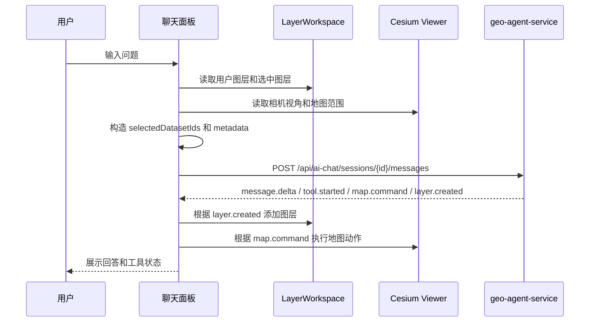

# 前端 ai-gis-studio-web AI 聊天 GIS 上下文改造计划

## 1. 改造目标

`ai-gis-studio-web` 的职责是把用户当前地图工作区整理成 AI 可理解的轻量上下文，并消费后端返回的结构化事件。

参考 NaLaMap 的数据传递方式，前端不需要把完整 GeoJSON 传给大模型，而是需要传：

- 当前会话消息。
- 当前可见或选中的图层。
- 图层对应的 `datasetId`。
- 图层名称、类型、bbox、透明度、可见性等轻量元数据。
- 当前 Cesium 地图视角。
- 前端支持执行的地图命令能力。

后端会根据这些 `datasetId/dataRef` 读取真实 GIS 数据并执行工具。

## 2. 当前已有基础

项目中已有的相关能力：

- `src/services/ai-chat.ts` 已支持 SSE 聊天请求，入参包含 `selectedDatasetIds`、`selectedServiceIds`、`metadata`。
- `src/features/chat/hooks/use-ai-chat-runtime.ts` 已接入 `@assistant-ui/react`。
- `src/services/gis-data.ts` 已支持数据集列表、详情、预览、上传和 URL 注册。
- `src/services/user-layers.ts` 已支持用户图层树 CRUD。
- `src/features/layers/layer-workspace.tsx` 已维护 `userLayers`，并提供 `executeMapCommand(command)`。
- `src/lib/cesium/map-command` 已支持执行 `camera.flyTo`、`layer.addDataset`、`layer.setVisible`、`layer.setOpacity`、`overlay.addMarker`、`map.clearTemporary`。
- `src/types/agent.ts` 已定义 `InputDataSummary`、`AgentEvent`、`MapCommand`、`MapLayerResult` 等类型。

当前主要缺口：

- `useAiChatRuntime` 发送消息时仍固定传 `selectedDatasetIds: []`。
- 聊天请求没有携带当前图层、可见图层、地图视角等上下文。
- 前端还没有完整消费 `map.command`、`layer.created`、`data.summary`、`plan.created` 等事件。
- 用户图层选择状态尚未与聊天问题绑定。
- 聊天 UI 对工具调用状态和结果图层的展示还不完整。

## 3. 前端目标数据流



## 4. 需要新增的聊天上下文结构

建议在前端统一构造如下 `metadata`：

```ts
type AiChatMetadata = {
  mapView?: {
    center?: [number, number];
    height?: number;
    bbox?: [number, number, number, number];
  };
  layers?: Array<{
    layerId: string;
    datasetId: string;
    name: string;
    visible: boolean;
    opacity: number;
    geometryType?: string | null;
    bbox?: [number, number, number, number] | null;
  }>;
  selectedLayerIds?: string[];
  activeDatasetIds?: string[];
  clientCapabilities?: {
    mapCommands: string[];
  };
};
```

`selectedDatasetIds` 推荐生成规则：

1. 如果用户显式选择了图层，传选中图层对应的 datasetId。
2. 如果没有显式选择，传所有 `visible=true` 的用户图层 datasetId。
3. 如果没有可见图层，传空数组，并在 `metadata.layers` 中也传空数组。

## 5. 具体开发任务

### 5.1 新增聊天上下文构建器

建议新增文件：

- `src/features/chat/utils/build-chat-context.ts`

职责：

- 输入 `userLayers`、选中图层 ID、Cesium viewer。
- 输出 `selectedDatasetIds`、`selectedServiceIds`、`metadata`。
- 去重 datasetId。
- 过滤无效图层。
- 附带前端支持的地图命令能力。

建议输出：

```ts
type BuildChatContextResult = {
  selectedDatasetIds: string[];
  selectedServiceIds: string[];
  metadata: AiChatMetadata;
};
```

### 5.2 扩展 `LayerWorkspaceProvider`

涉及文件：

- `src/features/layers/layer-workspace.tsx`

需要补充：

- 暴露 `userLayers` 给聊天运行时使用。
- 暴露当前 Cesium viewer 或提供读取地图视角的方法。
- 增加图层选择状态，例如 `selectedLayerIds`。
- 提供 `setSelectedLayerIds()` 或 `toggleSelectedLayer()`。

第一阶段可以简化：

- 不做 UI 多选。
- 默认把所有可见用户图层作为聊天上下文。

### 5.3 修改 `useAiChatRuntime`

涉及文件：

- `src/features/chat/hooks/use-ai-chat-runtime.ts`

当前调用：

```ts
selectedDatasetIds: [],
selectedServiceIds: [],
metadata: { tools: [] },
```

需要改为：

```ts
const chatContext = buildChatContext({
  userLayers,
  selectedLayerIds,
  viewer,
});

sendAiChatMessage({
  accessToken,
  sessionId,
  message,
  selectedDatasetIds: chatContext.selectedDatasetIds,
  selectedServiceIds: chatContext.selectedServiceIds,
  metadata: chatContext.metadata,
  abortSignal,
});
```

注意事项：

- 没有登录时仍保持当前错误逻辑。
- 没有图层时也允许提问。
- datasetId 要去重，避免同一数据集重复传入。

### 5.4 扩展 AI 聊天 SSE 事件类型

涉及文件：

- `src/services/ai-chat.ts`
- `src/types/agent.ts`

建议把 `AiChatStreamEvent` 扩展为兼容后端 agent 事件：

- `data.summary`
- `plan.created`
- `tool.started`
- `tool.completed`
- `tool.failed`
- `layer.created`
- `map.command`
- `chart.created`
- `clarification`
- `message.delta`
- `message.completed`
- `error`
- `done`

`map.command` 示例：

```json
{
  "type": "map.command",
  "sessionId": "session_x",
  "data": {
    "commandId": "cmd_x",
    "command": {
      "action": "layer.addDataset",
      "datasetId": "dataset_result",
      "name": "学校缓冲区",
      "visible": true,
      "opacity": 0.8,
      "flyTo": true
    },
    "reason": "显示分析结果图层"
  }
}
```

### 5.5 在聊天 runtime 中处理地图事件

需要处理：

- `message.delta`：保持当前流式文本逻辑。
- `message.completed`：保持当前完成逻辑。
- `tool.started`：记录工具状态。
- `tool.completed`：更新工具状态。
- `tool.failed`：展示可读错误。
- `map.command`：调用 `executeMapCommand(command)`。
- `layer.created`：根据后端返回结果创建或刷新用户图层。
- `clarification`：展示澄清问题和选项。

建议第一阶段先实现：

- `tool.started`
- `tool.completed`
- `tool.failed`
- `map.command`

`layer.created` 可由后端同时返回 `layer.addDataset` 命令，前端先只执行地图命令。

### 5.6 地图命令执行结果回传

建议后续新增服务方法：

```ts
export const reportMapCommandResult = async ({
  accessToken,
  sessionId,
  commandId,
  result,
}: {
  accessToken: string;
  sessionId: string;
  commandId: string;
  result: MapCommandResult;
}) => { ... };
```

对应后端接口：

```http
POST /api/ai-chat/sessions/{sessionId}/map-command-results
```

第一阶段可以不做，但建议在文档和类型里预留。

## 6. 推荐实现顺序

### P0：上下文传递跑通

- 新增 `build-chat-context.ts`。
- `useAiChatRuntime` 读取可见用户图层。
- 聊天请求发送真实 `selectedDatasetIds`。
- `metadata.layers` 带上图层摘要。

验收：

- 打开浏览器 Network，聊天请求体中能看到真实 datasetId 和图层摘要。

### P1：消费工具和数据摘要事件

- 扩展 `AiChatStreamEvent` 类型。
- 处理 `data.summary`。
- 处理 `tool.started/tool.completed/tool.failed`。
- 聊天 UI 展示工具运行状态。

验收：

- 后端发工具事件时，前端不会报错，并能展示工具进度。

### P2：地图命令闭环

- 处理 `map.command`。
- 调用 `executeMapCommand(command)`。
- 支持添加图层、飞行定位、显隐、透明度、临时标记。

验收：

- 后端返回 `layer.addDataset` 命令后，Cesium 地图自动加载对应数据集。

### P3：图层选择和交互增强

- 支持图层树选择状态。
- 支持聊天问题只针对选中图层。
- 支持 `@图层名` 引用。
- 支持 `clarification` 事件 UI。

验收：

- 用户选择一个图层后提问，后端只收到该图层对应 datasetId。

## 7. 前端验收清单

- 聊天请求能携带真实 `selectedDatasetIds`。
- `metadata.layers` 能反映当前用户图层列表。
- 没有图层时聊天仍能正常发送。
- `map.command` 能被前端执行。
- 工具事件不会破坏流式消息渲染。
- 新生成的数据集能通过地图命令加入地图。
- 错误事件能以用户可读方式展示。

## 8. 重点文件清单

需要修改：

- `ai-gis-studio-web/src/features/chat/hooks/use-ai-chat-runtime.ts`
- `ai-gis-studio-web/src/services/ai-chat.ts`
- `ai-gis-studio-web/src/features/layers/layer-workspace.tsx`
- `ai-gis-studio-web/src/types/agent.ts`

需要复用：

- `ai-gis-studio-web/src/services/gis-data.ts`
- `ai-gis-studio-web/src/services/user-layers.ts`
- `ai-gis-studio-web/src/lib/cesium/map-command/executor.ts`
- `ai-gis-studio-web/src/lib/cesium/map-command/*`

建议新增：

- `ai-gis-studio-web/src/features/chat/utils/build-chat-context.ts`
- `ai-gis-studio-web/src/features/chat/components/tool-call-status.tsx`
- `ai-gis-studio-web/src/services/map-command-results.ts`

## 9. 最小可交付版本

最小版本只需要完成：

1. 聊天请求带上当前可见图层 datasetId。
2. 聊天请求带上图层摘要和地图命令能力。
3. 前端能消费后端返回的 `data.summary` 和 `tool.*` 事件。
4. 前端能执行 `map.command`。

这个版本跑通后，前端就完成了 NaLaMap 式架构中的关键职责：提供上下文，执行地图动作，不直接把完整 GIS 数据交给模型。
